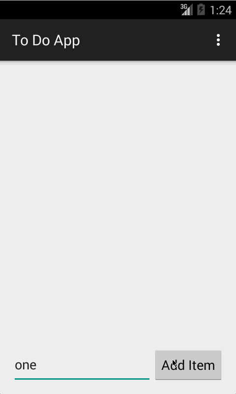

# To Do App

This is a simple to do app that supports adding, editing, and removing items from a list.  The list is written to and read from a file for persistence.

Time spent: 3 hours spent in total

Completed user stories:

* [x] Support adding items to the list.
* [x] Support removing items from the list.
* [x] Support editing items in the list.
* [x] Persist items to a file.

Walkthrough of all user stories:

GIF created with [LiceCap](http://www.cockos.com/licecap/).